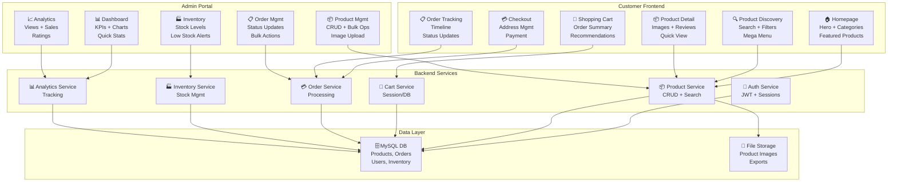
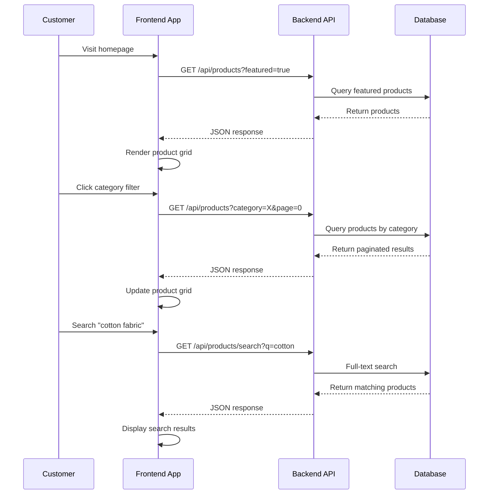
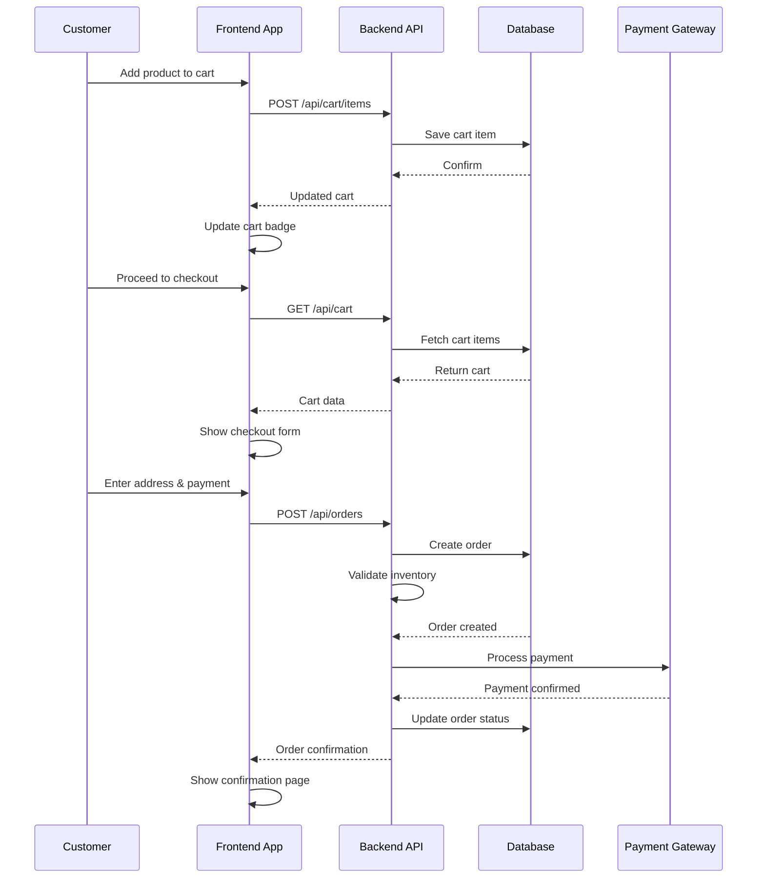
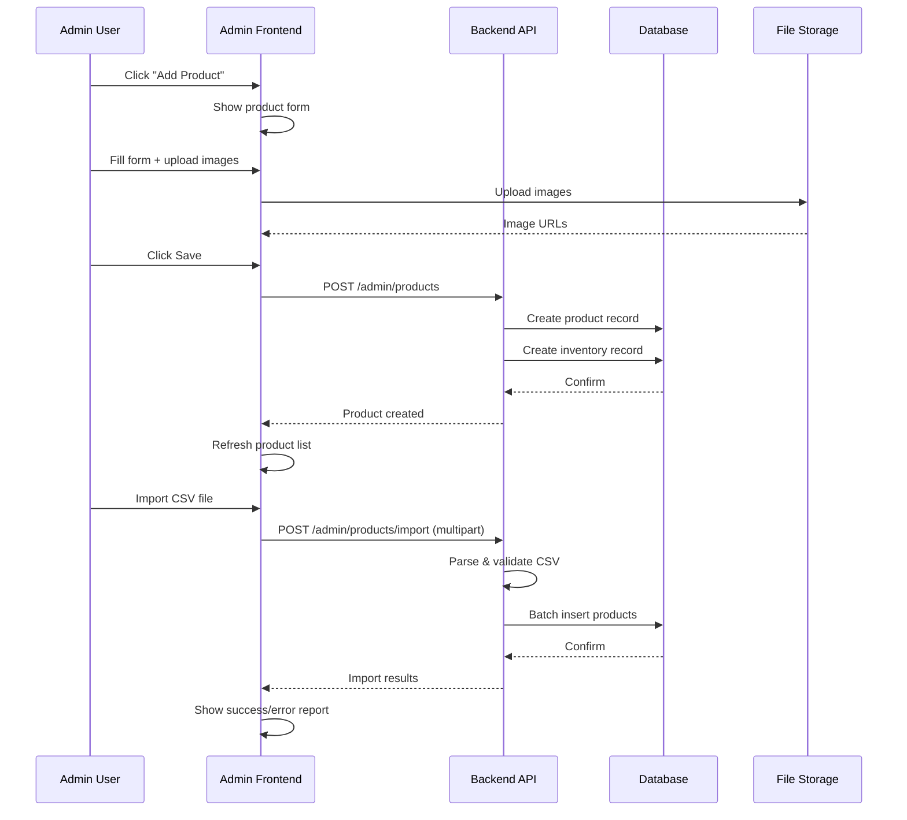

# Design Document: E-Commerce Frontend & Admin Portal Enhancement

## Overview

This design document outlines the modernization of the TAMILARASU ENTERPRISES e-commerce platform to match BigBasket/Flipkart standards. The enhancement focuses on two primary areas: (1) **Customer-Facing Frontend** with modern UI patterns, improved product discovery, streamlined checkout, and order tracking; and (2) **Admin Portal** with enhanced product management, inventory dashboards, bulk operations, and analytics. The design maintains the existing organic green and warm earth tone color scheme while introducing modern interaction patterns, responsive layouts, and performance optimizations.

## Architecture Overview



## Customer-Facing Frontend

### 1. Navigation & Header

**Sticky Top Bar**
- Logo + Brand name (left)
- Search bar with autocomplete (center)
- Category mega-menu (dropdown on hover)
- Cart icon with badge (right)
- Hamburger menu for mobile

**Promotional Banner**
- Dismissible banner above navbar
- Rotating promotions/announcements
- Call-to-action buttons

**Category Mega-Menu**
- Multi-column layout
- Subcategories with icons
- Featured products per category
- Quick links to sale/new arrivals

### 2. Homepage

**Hero Section**
- Full-width banner with gradient background
- Headline + CTA button
- Rotating carousel (3-5 slides)
- Responsive image optimization

**Featured Products Section**
- Grid layout (4 columns desktop, 2 mobile)
- Product cards with:
  - Product image with hover zoom
  - Discount badge (% off)
  - Star rating (1-5 stars)
  - Price + original price (strikethrough)
  - Quick-view button
  - Wishlist heart icon
  - Add to cart button

**Category Showcase**
- 6-8 category cards
- Category image + name
- Product count
- Link to category page

### 3. Product Discovery Page

**Left Sidebar Filters**
- Category filter (checkbox tree)
- Price range slider (₹0 - ₹10,000+)
- Rating filter (4★+, 3★+, etc.)
- Availability filter (In Stock, Out of Stock)
- Brand filter (if applicable)
- Clear all filters button

**Main Content Area**
- Sort dropdown (Relevance, Price Low-High, Price High-Low, Newest, Best Sellers, Ratings)
- Product grid (responsive columns)
- Lazy loading for images
- Infinite scroll or pagination

**Product Card Enhanced**
- Thumbnail image
- Product name (2-line truncation)
- Category badge
- Star rating + review count
- Price + discount percentage
- Stock status indicator
- Quick-view modal button
- Wishlist toggle
- Add to cart button

### 4. Product Detail Page

**Image Gallery**
- Main image (large)
- Thumbnail strip (5-8 images)
- Zoom on hover
- Image carousel for mobile

**Product Information**
- Product name + category
- Star rating + review count
- Price + original price + discount %
- Stock status (In Stock / Low Stock / Out of Stock)
- Quantity selector (spinner)
- Add to cart button (primary)
- Add to wishlist button (secondary)
- Share buttons (WhatsApp, Facebook, Copy Link)

**Product Details Section**
- Description
- Specifications table
- Delivery information
- Return policy
- Seller information

**Reviews Section**
- Average rating display
- Rating distribution (5★, 4★, etc.)
- Review list with:
  - Reviewer name + date
  - Star rating
  - Review title + text
  - Helpful votes
- Write review button (for logged-in users)

**Recommended Products**
- "Customers also bought" carousel
- "Similar products" section

### 5. Shopping Cart Page

**Cart Items Table**
- Product image + name
- Price per unit
- Quantity selector (with +/- buttons)
- Subtotal per item
- Remove button

**Order Summary (Right Sidebar)**
- Subtotal
- Discount (if applicable)
- Tax
- Shipping cost
- **Total (highlighted)**
- Proceed to checkout button
- Continue shopping button

**Recommended Products**
- "Complete your order" section
- 3-4 product suggestions
- Add to cart from recommendations

**Empty Cart State**
- Illustration
- "Your cart is empty" message
- Continue shopping button

### 6. Checkout Flow

**Step 1: Delivery Address**
- Address form (Name, Phone, Address, City, State, Pincode)
- Saved addresses dropdown (for logged-in users)
- Add new address option
- Set as default checkbox
- Next button

**Step 2: Order Summary**
- Order items list (read-only)
- Subtotal, tax, shipping
- Promo code input
- Total amount

**Step 3: Payment Method**
- Credit/Debit card option
- UPI option
- Net banking option
- Wallet option (if applicable)
- Payment gateway integration

**Step 4: Order Confirmation**
- Order number
- Estimated delivery date
- Order summary
- Download invoice button
- Continue shopping button

**Checkout Progress Indicator**
- Step 1: Address
- Step 2: Summary
- Step 3: Payment
- Step 4: Confirmation

### 7. Order Tracking Page

**Order List**
- Recent orders at top
- Order card showing:
  - Order number
  - Order date
  - Total amount
  - Current status badge
  - View details button

**Order Detail View**
- Order number + date
- Order items (product image, name, quantity, price)
- Delivery address
- Payment method
- Order total

**Order Timeline**
- Vertical timeline showing:
  - Order Placed (✓ completed)
  - Processing (✓ completed)
  - Shipped (current)
  - Out for Delivery (pending)
  - Delivered (pending)
- Timestamps for completed steps
- Estimated delivery date

**Tracking Information**
- Carrier name
- Tracking number
- Estimated delivery date
- Contact seller button

### 8. Responsive Mobile Design

**Mobile Navigation**
- Hamburger menu (3 lines icon)
- Slide-out menu with:
  - Categories
  - Account
  - Orders
  - Wishlist
  - Logout

**Mobile Product Grid**
- 2 columns on small phones
- 2-3 columns on tablets
- Touch-friendly buttons (min 44px)

**Mobile Checkout**
- Full-screen forms
- One field per screen (progressive disclosure)
- Large touch targets
- Mobile payment options (UPI, Google Pay)

---

## Admin Portal

### 1. Dashboard

**KPI Cards (Top Row)**
- Total Products (count)
- Total Revenue (₹)
- Total Orders (count)
- Average Order Value (₹)

**Charts Section**
- Sales trend (line chart, last 30 days)
- Top 5 selling products (bar chart)
- Order status distribution (pie chart)
- Revenue by category (horizontal bar)

**Quick Actions**
- Add new product button
- View pending orders button
- Check low stock items button
- Generate report button

**Recent Orders Table**
- Order number
- Customer name
- Order date
- Total amount
- Status
- View button

### 2. Product Management

**Product List View**
- Table with columns:
  - Product image (thumbnail)
  - Product name + ID
  - Category
  - Price
  - Stock quantity
  - Status (In Stock / Out of Stock)
  - Actions (Edit, Delete)

**Table Features**
- Search by name/category/ID
- Sort by name, price, stock, date added
- Filter by category
- Filter by status
- Pagination (20 items per page)
- Bulk select checkbox
- Bulk actions (Delete, Update Stock, Change Category)

**Add/Edit Product Modal**
- Product name (required, max 120 chars)
- Description (optional, max 1000 chars)
- Price (required, positive number)
- Category dropdown (required)
- Initial stock quantity
- Image URLs (up to 5, one per line)
- Image preview strip
- Save button
- Cancel button

**Image Upload**
- Drag-drop zone
- File browser
- Image preview
- Remove image button
- Max 5 images per product
- Supported formats: JPG, PNG, WebP

### 3. Inventory Management

**Inventory Dashboard**
- Total products count
- In stock count
- Out of stock count
- Low stock count (< 10 units)

**Low Stock Alerts**
- Table showing products with stock < 10
- Product name + current stock
- Reorder quantity suggestion
- Update stock button
- Mark as discontinued button

**Stock Update Form**
- Product selector (dropdown or search)
- Current stock display
- New stock quantity input
- Reason for update (dropdown: Purchase, Sale, Adjustment, Return)
- Notes field
- Update button

**Stock History**
- Log of all stock changes
- Product name
- Change amount (+ or -)
- Reason
- Timestamp
- Updated by (admin name)

### 4. Product Analytics

**Analytics Dashboard**
- Date range picker (Last 7 days, 30 days, 90 days, Custom)

**Product Performance Table**
- Product name
- Views (total page views)
- Clicks (add to cart clicks)
- Conversion rate (% of views → purchases)
- Sales (units sold)
- Revenue (₹)
- Average rating
- Review count

**Charts**
- Top 10 products by views (bar chart)
- Top 10 products by sales (bar chart)
- Top 10 products by revenue (bar chart)
- Product rating distribution (histogram)

### 5. Order Management

**Order List**
- Table with columns:
  - Order number
  - Customer name
  - Order date
  - Total amount
  - Status (Pending, Processing, Shipped, Delivered, Cancelled)
  - Actions (View, Update Status, Cancel)

**Filters**
- Status filter (multi-select)
- Date range picker
- Customer search
- Order amount range

**Order Detail View**
- Order number + date
- Customer information (name, email, phone)
- Delivery address
- Order items (product, quantity, price)
- Order total
- Payment method
- Order status timeline
- Update status dropdown
- Cancel order button
- Print invoice button

**Bulk Actions**
- Select multiple orders
- Bulk status update
- Bulk export to CSV

### 6. Batch Import/Export

**CSV Import**
- File upload (drag-drop or file browser)
- CSV format validation
- Data preview (first 5 rows)
- Validation feedback:
  - Success count
  - Error count
  - Error details (row number, field, error message)
- Import button
- Cancel button

**CSV Export**
- Export all products
- Export filtered products
- Export selected products
- Format: CSV with columns (ID, Name, Description, Price, Category, Stock, Images)
- Download button

**CSV Format Specification**
```
ID,Name,Description,Price,Category,Stock,ImageURLs
1,Product Name,Description text,999.99,Category Name,50,"url1.jpg,url2.jpg"
```

### 7. Admin Sidebar Navigation

- 📊 Dashboard
- 📦 Products
- 🏭 Inventory
- 📋 Orders
- 📈 Reports
- ⚙️ Settings (future)

---

## Data Flow Diagrams

### Customer Product Discovery Flow



### Shopping Cart & Checkout Flow



### Admin Product Management Flow



---

## Component Interfaces

### Frontend Components

#### ProductCard Component
```
Props:
  - id: number
  - name: string
  - price: number
  - originalPrice?: number
  - image: string
  - category: string
  - rating: number (0-5)
  - reviewCount: number
  - inStock: boolean
  - discount?: number (%)
  - onAddToCart: (id, quantity) => void
  - onQuickView: (id) => void
  - onWishlist: (id) => void

Emits:
  - add-to-cart: { productId, quantity }
  - quick-view: { productId }
  - wishlist-toggle: { productId, added }
```

#### ShoppingCart Component
```
Props:
  - items: CartItem[]
  - subtotal: number
  - tax: number
  - shipping: number
  - total: number
  - onUpdateQuantity: (itemId, quantity) => void
  - onRemoveItem: (itemId) => void
  - onCheckout: () => void

Emits:
  - quantity-changed: { itemId, quantity }
  - item-removed: { itemId }
  - checkout-initiated: {}
```

#### OrderTimeline Component
```
Props:
  - steps: OrderStep[]
  - currentStep: string
  - timestamps: { [step]: Date }

OrderStep:
  - id: string
  - label: string
  - icon: string
  - completed: boolean
  - estimatedDate?: Date
```

### Admin Components

#### ProductTable Component
```
Props:
  - products: Product[]
  - loading: boolean
  - sortBy: string
  - filterCategory?: string
  - searchQuery?: string
  - onEdit: (id) => void
  - onDelete: (id) => void
  - onBulkDelete: (ids[]) => void
  - onBulkUpdateStock: (ids[], quantity) => void

Emits:
  - edit: { productId }
  - delete: { productId }
  - bulk-action: { action, ids }
```

#### InventoryAlert Component
```
Props:
  - lowStockProducts: Product[]
  - threshold: number (default 10)
  - onUpdateStock: (productId, quantity) => void
  - onMarkDiscontinued: (productId) => void

Emits:
  - stock-updated: { productId, newQuantity }
  - discontinued: { productId }
```

#### CSVImportModal Component
```
Props:
  - isOpen: boolean
  - onClose: () => void
  - onImport: (file) => void

Emits:
  - import-started: {}
  - import-completed: { imported, errors }
  - import-failed: { error }
```

---

## API Endpoints

### Product Endpoints
```
GET    /api/products                    # List products (paginated)
GET    /api/products/:id                # Get product detail
GET    /api/products/search?q=query     # Search products
GET    /api/categories                  # List categories
POST   /admin/products                  # Create product
PUT    /admin/products/:id              # Update product
DELETE /admin/products/:id              # Delete product
POST   /admin/products/import           # Bulk import CSV
GET    /admin/products/export           # Export CSV
```

### Cart Endpoints
```
GET    /api/cart                        # Get current cart
POST   /api/cart/items                  # Add item to cart
PUT    /api/cart/items/:itemId          # Update cart item quantity
DELETE /api/cart/items/:itemId          # Remove item from cart
DELETE /api/cart                        # Clear cart
```

### Order Endpoints
```
POST   /api/orders                      # Create order
GET    /api/orders                      # List user's orders
GET    /api/orders/:id                  # Get order detail
GET    /api/orders/:id/tracking         # Get tracking info
PUT    /admin/orders/:id/status         # Update order status
DELETE /admin/orders/:id                # Cancel order
GET    /admin/orders/export             # Export orders CSV
```

### Inventory Endpoints
```
GET    /api/inventory                   # Get inventory summary
GET    /api/inventory/low-stock         # Get low stock alerts
PUT    /admin/inventory/:productId      # Update stock
GET    /admin/inventory/history         # Stock change history
```

### Analytics Endpoints
```
GET    /api/analytics/products          # Product performance
GET    /api/analytics/sales             # Sales metrics
GET    /api/analytics/orders            # Order metrics
GET    /api/analytics/dashboard         # Dashboard KPIs
```

---

## State Management

### Frontend State Structure
```
{
  auth: {
    user: User | null,
    isAuthenticated: boolean,
    token: string | null
  },
  cart: {
    items: CartItem[],
    subtotal: number,
    tax: number,
    shipping: number,
    total: number,
    lastUpdated: Date
  },
  products: {
    list: Product[],
    current: Product | null,
    loading: boolean,
    filters: {
      category: string | null,
      priceRange: [number, number],
      rating: number | null,
      inStock: boolean | null
    },
    sort: string,
    page: number,
    pageSize: number,
    total: number
  },
  orders: {
    list: Order[],
    current: Order | null,
    loading: boolean
  },
  ui: {
    sidebarOpen: boolean,
    modalOpen: string | null,
    notifications: Notification[]
  }
}
```

### Admin State Structure
```
{
  auth: {
    user: AdminUser | null,
    isAuthenticated: boolean,
    token: string | null
  },
  products: {
    list: Product[],
    current: Product | null,
    loading: boolean,
    filters: {
      category: string | null,
      status: string | null,
      search: string | null
    },
    sort: string,
    page: number,
    pageSize: number,
    total: number,
    selected: number[] // for bulk operations
  },
  inventory: {
    summary: InventorySummary,
    lowStockItems: Product[],
    history: StockChange[],
    loading: boolean
  },
  orders: {
    list: Order[],
    current: Order | null,
    loading: boolean,
    filters: {
      status: string[],
      dateRange: [Date, Date],
      customerSearch: string | null
    }
  },
  analytics: {
    dashboard: DashboardMetrics,
    productPerformance: ProductAnalytics[],
    dateRange: string,
    loading: boolean
  },
  ui: {
    sidebarOpen: boolean,
    modalOpen: string | null,
    notifications: Notification[]
  }
}
```

---

## Performance Considerations

### Frontend Optimization
- **Image Lazy Loading**: Load product images only when visible in viewport
- **Infinite Scroll**: Load next page of products as user scrolls
- **Code Splitting**: Separate bundles for customer vs admin sections
- **Caching**: Cache product list, categories, and user data
- **Compression**: Gzip all API responses
- **CDN**: Serve static assets and product images from CDN

### Backend Optimization
- **Database Indexing**: Index on product name, category, price for fast searches
- **Query Optimization**: Use pagination, limit joins, avoid N+1 queries
- **Connection Pooling**: HikariCP with min 10, max 20 connections
- **Caching Layer**: Redis for frequently accessed data (categories, featured products)
- **Batch Operations**: Support bulk import/export to reduce API calls

### Target Metrics
- Homepage load: < 2 seconds
- Product page load: < 1.5 seconds
- Search results: < 500ms
- Admin dashboard: < 1 second
- Support 100+ concurrent users

---

## Security Considerations

### Authentication & Authorization
- JWT tokens with 24-hour expiration
- Refresh token rotation
- Role-based access control (RBAC): Customer, Admin
- Session timeout after 30 minutes of inactivity
- Password hashing with bcrypt (salt rounds: 10)

### Data Protection
- HTTPS for all communication
- Input validation and sanitization (prevent SQL injection, XSS)
- CSRF tokens for state-changing operations
- Rate limiting on login attempts (5 attempts → 30 min lockout)
- PCI DSS compliance: No credit card storage (use payment gateway)

### Admin Security
- Admin endpoints require authentication + ADMIN role
- Audit logging for all admin actions
- IP whitelisting (optional)
- Two-factor authentication (future enhancement)

---

## Error Handling & Validation

### Frontend Validation
- Client-side form validation (required fields, format, length)
- Real-time validation feedback
- Clear error messages
- Retry logic for failed API calls

### Backend Validation
- Server-side validation (all inputs)
- Detailed error responses with field-level errors
- Consistent error format:
  ```json
  {
    "status": 400,
    "error": "Validation failed",
    "details": {
      "name": "Product name is required",
      "price": "Price must be positive"
    }
  }
  ```

### Error Recovery
- Automatic retry for transient failures (network timeout)
- User-friendly error messages
- Fallback UI for failed states
- Error logging and monitoring

---

## Testing Strategy

### Frontend Testing
- **Unit Tests**: Component logic, utilities, helpers
- **Integration Tests**: Component interactions, API calls
- **E2E Tests**: User workflows (add to cart, checkout, order tracking)
- **Visual Regression**: Screenshot comparison for UI changes

### Admin Testing
- **Unit Tests**: Product CRUD, inventory updates, analytics calculations
- **Integration Tests**: CSV import/export, bulk operations
- **E2E Tests**: Admin workflows (add product, manage inventory, view orders)

### Performance Testing
- Load testing: 100+ concurrent users
- Stress testing: Peak load scenarios
- Soak testing: Long-running stability

---

## Accessibility Considerations

### WCAG 2.1 Compliance (Level AA)
- Semantic HTML (proper heading hierarchy, landmarks)
- ARIA labels for interactive elements
- Keyboard navigation support (Tab, Enter, Escape)
- Color contrast ratio ≥ 4.5:1 for text
- Touch targets ≥ 44px × 44px on mobile
- Alt text for all images
- Form labels associated with inputs
- Error messages linked to form fields

### Screen Reader Support
- Announce dynamic content changes
- Describe icons and buttons
- Provide context for links
- Announce loading states

---

## Deployment & DevOps

### Frontend Deployment
- Build: npm run build (minification, tree-shaking)
- Deployment: Static hosting (AWS S3 + CloudFront, Netlify, Vercel)
- CI/CD: GitHub Actions / GitLab CI
- Environment variables: API endpoint, analytics keys

### Admin Portal Deployment
- Same as frontend (separate build or same codebase with routing)
- Protected by authentication middleware
- Admin-only API endpoints

### Backend Deployment
- Docker containerization
- Kubernetes orchestration (optional)
- Database migrations on deployment
- Health checks and monitoring
- Rollback strategy

---

## Future Enhancements

1. **Wishlist Feature**: Save products for later
2. **Product Reviews & Ratings**: Customer feedback system
3. **Personalization**: Recommendations based on browsing history
4. **Multi-language Support**: Hindi, Tamil, etc.
5. **Advanced Analytics**: Cohort analysis, funnel analysis
6. **Subscription Orders**: Recurring purchases
7. **Seller Dashboard**: Multi-vendor support
8. **Mobile App**: Native iOS/Android apps
9. **Live Chat Support**: Customer service integration
10. **Loyalty Program**: Points and rewards system

---

## Success Metrics

### Customer Experience
- Page load time < 2 seconds (90th percentile)
- Cart abandonment rate < 70%
- Checkout completion rate > 60%
- Customer satisfaction score > 4.0/5.0

### Admin Efficiency
- Product creation time < 2 minutes
- Bulk import processing < 5 seconds for 100 products
- Order processing time < 1 minute
- Admin task completion rate > 95%

### Business Metrics
- Conversion rate > 2%
- Average order value increase > 15%
- Customer retention rate > 40%
- Revenue growth > 25% YoY
