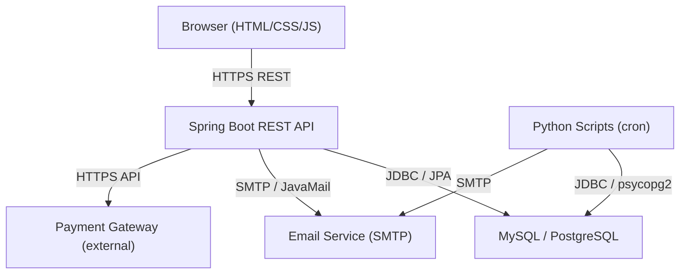

# Design Document: TAMILARASU ENTERPRISES E-Commerce Website

## Overview

TAMILARASU ENTERPRISES is an import/export company that needs a full-featured e-commerce platform to sell products online. The system enables customers to browse a product catalog, manage a shopping cart, place orders, and track deliveries. Administrators manage products, inventory, orders, and receive automated reports.

The platform is built on a Java Spring Boot backend exposing REST APIs, an HTML/CSS/JS frontend, a relational SQL database (MySQL or PostgreSQL), and Python scripts for automation tasks (reporting, CSV processing, email delivery).

### Key Design Goals

- Secure, authenticated access for customers and administrators
- Accurate inventory management preventing overselling
- Reliable order lifecycle with email notifications at every stage
- Automated daily reporting via Python scripts
- Bulk product management via CSV import/export
- Responsive UI from 320px to 1920px
- Sub-500ms search response times with full-text indexing

---

## Architecture

The system follows a layered MVC architecture with a clear separation between the REST API backend and the static HTML/JS frontend.



### Layer Responsibilities

- **Frontend**: Static HTML pages with vanilla JS calling REST endpoints. Handles session storage for guest carts, client-side validation, and responsive layout.
- **Spring Boot API**: Controllers → Services → Repositories. Handles authentication (Spring Security), business logic, and data persistence.
- **Python Scripts**: Scheduled via cron. Handle daily report generation, CSV import/export, and email delivery with retry logic.
- **Database**: Single relational schema shared by Java and Python layers.
- **Payment Gateway**: External provider (e.g., Stripe or Razorpay). Card data never touches the application database.

---

## Components and Interfaces

### Backend Components

#### UserService
- `register(RegistrationRequest)` → `UserResponse` — validates uniqueness, hashes password with BCrypt, persists user, queues welcome email
- `authenticate(LoginRequest)` → `SessionToken` — verifies credentials, enforces lockout policy
- `lockAccount(userId)` / `unlockAccount(userId)` — manages brute-force lockout

#### ProductService
- `search(query, category, sort, page)` → `Page<ProductSummary>` — full-text search with relevance ranking, pagination (20/page)
- `getDetail(productId)` → `ProductDetail` — includes images, specs, availability
- `getSuggestions(prefix)` → `List<String>` — popular query suggestions
- `create(ProductRequest)` / `update(productId, ProductRequest)` / `deactivate(productId)` — admin CRUD

#### InventoryService
- `getStock(productId)` → `int`
- `decrement(productId, qty)` — called on order creation; throws `InsufficientStockException` if stock < qty
- `restore(productId, qty)` — called on order cancellation
- `getLowStockProducts()` → `List<Product>` — products with qty < 10

#### CartService
- `addItem(cartId, productId)` / `updateItem(cartId, itemId, qty)` / `removeItem(cartId, itemId)`
- `getCart(cartId)` → `CartSummary` — includes subtotal, tax, total
- `mergeGuestCart(sessionCart, userId)` — merges session storage cart into DB on login

#### OrderService
- `checkout(CheckoutRequest)` → `OrderResponse` — validates inventory, calls payment gateway, creates order, decrements inventory, queues confirmation email
- `getOrderHistory(userId)` → `List<OrderSummary>`
- `getOrderDetail(orderId)` → `OrderDetail`
- `updateStatus(orderId, status)` — admin; triggers notification email
- `cancelOrder(orderId, reason)` — admin; restores inventory, initiates refund, notifies customer

#### ReportService
- `generateDailyReport(date)` → `ReportRecord` — aggregates sales data, persists to DB
- `getReports()` → `List<ReportRecord>` — admin history view

### REST API Endpoints

| Method | Path | Description |
|--------|------|-------------|
| POST | `/api/auth/register` | Customer registration |
| POST | `/api/auth/login` | Customer login |
| GET | `/api/products` | Paginated catalog (filterable, sortable) |
| GET | `/api/products/{id}` | Product detail |
| GET | `/api/products/search` | Search with suggestions |
| GET | `/api/cart` | Get current cart |
| POST | `/api/cart/items` | Add item to cart |
| PUT | `/api/cart/items/{id}` | Update item quantity |
| DELETE | `/api/cart/items/{id}` | Remove item |
| POST | `/api/orders/checkout` | Place order |
| GET | `/api/orders` | Order history (authenticated) |
| GET | `/api/orders/{id}` | Order detail |
| POST | `/admin/products` | Create product |
| PUT | `/admin/products/{id}` | Update product |
| DELETE | `/admin/products/{id}` | Deactivate product |
| GET | `/admin/products/export` | Export products CSV |
| POST | `/admin/products/import` | Import products CSV |
| PUT | `/admin/inventory/{productId}` | Update stock |
| GET | `/admin/inventory/low-stock` | Low stock report |
| GET | `/admin/orders` | All orders (filterable) |
| PUT | `/admin/orders/{id}/status` | Update order status |
| POST | `/admin/orders/{id}/cancel` | Cancel order |
| GET | `/admin/orders/export` | Export orders CSV |
| GET | `/admin/reports` | List past reports |
| GET | `/admin/reports/{id}` | Download report |

### Python Scripts

| Script | Trigger | Responsibility |
|--------|---------|----------------|
| `daily_report.py` | cron midnight | Aggregate sales, store report, send email |
| `csv_import.py` | CLI / API call | Validate and import product CSV |
| `csv_export.py` | CLI / API call | Export products to CSV |
| `email_notifier.py` | Module import | Reusable SMTP sender with retry logic |

---

## Data Models

```mermaid
erDiagram
    USERS {
        bigint id PK
        varchar email UK
        varchar password_hash
        varchar name
        varchar phone
        enum role
        boolean locked
        int failed_attempts
        timestamp lock_time
        timestamp created_at
    }
    CATEGORIES {
        bigint id PK
        varchar name
        varchar slug
    }
    PRODUCTS {
        bigint id PK
        varchar name
        text description
        decimal price
        bigint category_id FK
        boolean active
        timestamp created_at
    }
    PRODUCT_IMAGES {
        bigint id PK
        bigint product_id FK
        varchar url
        int sort_order
    }
    INVENTORY {
        bigint id PK
        bigint product_id FK UK
        int quantity
        boolean out_of_stock
    }
    CARTS {
        bigint id PK
        bigint user_id FK
        varchar session_id
        timestamp updated_at
    }
    CART_ITEMS {
        bigint id PK
        bigint cart_id FK
        bigint product_id FK
        int quantity
    }
    ORDERS {
        bigint id PK
        varchar order_number UK
        bigint user_id FK
        decimal subtotal
        decimal tax
        decimal total
        enum status
        text delivery_address
        varchar contact_phone
        timestamp created_at
    }
    ORDER_ITEMS {
        bigint id PK
        bigint order_id FK
        bigint product_id FK
        varchar product_name
        decimal unit_price
        int quantity
    }
    ORDER_STATUS_HISTORY {
        bigint id PK
        bigint order_id FK
        enum status
        text reason
        timestamp changed_at
    }
    REPORTS {
        bigint id PK
        date report_date UK
        decimal total_sales
        int order_count
        json top_products
        timestamp generated_at
    }

    USERS ||--o{ CARTS : "has"
    USERS ||--o{ ORDERS : "places"
    CATEGORIES ||--o{ PRODUCTS : "contains"
    PRODUCTS ||--o{ PRODUCT_IMAGES : "has"
    PRODUCTS ||--|| INVENTORY : "tracked by"
    CARTS ||--o{ CART_ITEMS : "contains"
    CART_ITEMS }o--|| PRODUCTS : "references"
    ORDERS ||--o{ ORDER_ITEMS : "contains"
    ORDER_ITEMS }o--|| PRODUCTS : "references"
    ORDERS ||--o{ ORDER_STATUS_HISTORY : "has"
```

### Key Design Decisions

- `ORDER_ITEMS` stores `product_name` and `unit_price` as snapshots — product edits don't alter historical orders.
- `INVENTORY` is a separate table (not a column on `PRODUCTS`) to allow row-level locking during concurrent order placement.
- `CARTS` supports both authenticated users (`user_id`) and guests (`session_id`).
- `REPORTS` stores `top_products` as JSON for flexible schema without additional join tables.
- Passwords are stored as BCrypt hashes only — plaintext is never persisted.
- Credit card data is never stored — the payment gateway handles tokenization.

---


## Correctness Properties

*A property is a characteristic or behavior that should hold true across all valid executions of a system — essentially, a formal statement about what the system should do. Properties serve as the bridge between human-readable specifications and machine-verifiable correctness guarantees.*

---

### Property 1: Registration round-trip creates account and queues welcome email

*For any* valid registration payload (unique email, compliant password, name, contact), submitting it should result in a new user record existing in the database and a welcome email being queued for delivery.

**Validates: Requirements 1.2, 15.1**

---

---

### Property 2: Duplicate email registration is rejected

*For any* email address that already exists in the system, a second registration attempt with that email should return an error and leave the user count unchanged.

**Validates: Requirements 1.3**

---

### Property 3: Passwords are never stored in plaintext

*For any* password submitted during registration, the value stored in the database should differ from the plaintext input and should be verifiable only via BCrypt comparison.

**Validates: Requirements 1.4**

---

### Property 4: Authentication correctness

*For any* registered user, providing the correct credentials should grant a session, and providing any incorrect credential (wrong password, non-existent email) should deny access and return an error.

**Validates: Requirements 1.5, 1.6**

---

### Property 5: Account lockout after repeated failures

*For any* account, after 5 consecutive failed login attempts within 15 minutes, all subsequent login attempts during the 30-minute lockout window should be rejected regardless of credential correctness.

**Validates: Requirements 12.7**

---

### Property 6: Password complexity enforcement

*For any* password that does not meet the minimum complexity rules (fewer than 8 characters, or missing letters, or missing numbers), registration should be rejected.

**Validates: Requirements 12.4**

---

### Property 7: Product catalog displays required fields

*For any* active product in the catalog, the response should include name, at least one image reference, price, and description.

**Validates: Requirements 2.1, 2.6**

---

### Property 8: Pagination size invariant

*For any* page of catalog results (except the last page), the number of products returned should be exactly 20.

**Validates: Requirements 2.2**

---

### Property 9: Search returns only matching products

*For any* search query and any product set, every product in the result set should contain the query string (case-insensitive) in its name or description, including partial word matches.

**Validates: Requirements 2.3, 11.2**

---

### Property 10: Category filter returns only matching products

*For any* category filter value, all products returned should belong to that category and no products from other categories should appear.

**Validates: Requirements 2.4**

---

### Property 11: Sort order invariant

*For any* sorted result set (by price, name, or date), every adjacent pair of products should satisfy the ordering relation for the chosen sort field.

**Validates: Requirements 2.5**

---

### Property 12: Exact matches rank before partial matches

*For any* search query where at least one product has an exact name match, all exact name matches should appear before any partial description-only matches in the result list.

**Validates: Requirements 11.3**

---

### Property 13: Cart add increments quantity correctly

*For any* product added to a cart that already contains that product, the resulting quantity should equal the previous quantity plus one.

**Validates: Requirements 3.1, 3.2**

---

### Property 14: Cart total calculation invariant

*For any* cart state, the total amount should equal the sum of (unit_price × quantity) for all items plus the applicable tax, and the subtotal should equal the sum of (unit_price × quantity) without tax.

**Validates: Requirements 3.5**

---

### Property 15: Authenticated cart persists to database

*For any* authenticated user, cart items added during a session should be retrievable from the database after the session ends and a new session begins.

**Validates: Requirements 3.7**

---

### Property 16: Checkout blocked on insufficient inventory

*For any* checkout attempt where at least one cart item's requested quantity exceeds available stock, the checkout should be rejected and no order should be created.

**Validates: Requirements 4.2, 4.3**

---

### Property 17: Successful payment creates unique order and queues confirmation email

*For any* successful payment, exactly one order record with a globally unique order number should be created, and a confirmation email should be queued for the customer.

**Validates: Requirements 4.5, 4.6, 15.2**

---

### Property 18: Failed payment leaves no order and no inventory change

*For any* payment failure, no order record should be created and all product stock quantities should remain unchanged from their pre-checkout values.

**Validates: Requirements 4.7, 4.8**

---

### Property 19: Inventory decrements match order quantities

*For any* successfully placed order, each product's stock quantity should decrease by exactly the quantity ordered for that product.

**Validates: Requirements 4.8, 6.1**

---

### Property 20: Order history completeness

*For any* authenticated customer, the order history endpoint should return all orders ever placed by that customer and no orders belonging to other customers.

**Validates: Requirements 5.1**

---

### Property 21: Order display contains required fields

*For any* order in the system, both the list view and detail view should include order number, date, total amount, and status; the detail view should additionally include products, quantities, and delivery address.

**Validates: Requirements 5.2, 5.3**

---

### Property 22: Order status is always a valid value

*For any* order at any point in its lifecycle, its status should be one of: Pending, Processing, Shipped, Delivered, Cancelled.

**Validates: Requirements 5.4**

---

### Property 23: Status change triggers notification email

*For any* order status change event, a notification email should be queued for the customer within the required time window.

**Validates: Requirements 5.5, 15.3**

---

### Property 24: Out-of-stock products are hidden from add-to-cart

*For any* product with zero stock quantity, it should be marked out-of-stock, display an out-of-stock indicator in the catalog, and have its add-to-cart action disabled.

**Validates: Requirements 6.2, 6.3**

---

### Property 25: Low stock report contains only qualifying products

*For any* low-stock report, every product in the report should have a current stock quantity strictly less than 10, and no product with quantity ≥ 10 should appear.

**Validates: Requirements 6.5**

---

### Property 26: Order cancellation restores inventory

*For any* cancelled order, each product's stock quantity should be restored by exactly the quantity that was ordered, returning to the pre-order stock level.

**Validates: Requirements 6.6**

---

### Property 27: Product CRUD round-trip

*For any* valid product creation payload, the created product should be retrievable with all submitted fields intact; for any valid update payload, the updated fields should be reflected in subsequent reads.

**Validates: Requirements 7.1, 7.2**

---

### Property 28: Deactivated products excluded from customer catalog

*For any* deactivated product, it should not appear in any customer-facing catalog or search results, but should still be referenced correctly in existing order history.

**Validates: Requirements 7.3**

---

### Property 29: Invalid product data is rejected

*For any* product creation or update with a non-positive price or missing required fields, the operation should be rejected with an error and no product should be created or modified.

**Validates: Requirements 7.4, 7.6**

---

### Property 30: Image upload limit enforced

*For any* product, attempting to associate more than 5 images should be rejected and the product's image count should remain at or below 5.

**Validates: Requirements 7.5**

---

### Property 31: Admin order filter returns only matching orders

*For any* combination of filter criteria (status, date range, customer), all returned orders should satisfy every applied filter and no non-matching orders should appear.

**Validates: Requirements 8.1**

---

### Property 32: Admin cancellation triggers refund and notification

*For any* admin-initiated order cancellation with a reason, the order should be marked Cancelled with the reason stored, a refund process should be initiated, and a notification email should be queued for the customer.

**Validates: Requirements 8.4, 8.5**

---

### Property 33: Order CSV export contains all order data

*For any* set of orders in the system, the exported CSV should contain one row per order with all required order fields, and no orders should be omitted.

**Validates: Requirements 8.6**

---

### Property 34: Daily report generation round-trip

*For any* day with order data, the generated report should contain the correct total sales, order count, and top-selling products for that day, and the report should be persistently retrievable from the database.

**Validates: Requirements 9.1, 9.4**

---

### Property 35: Daily report is sent to all configured admin addresses

*For any* generated daily report, an email should be sent to every address in the configured administrator list.

**Validates: Requirements 9.2**

---

### Property 36: CSV validation identifies all invalid rows

*For any* CSV file with invalid rows, the validation step should produce an error report that identifies exactly those rows (no false positives, no false negatives), and no product should be created or updated for any invalid row.

**Validates: Requirements 10.2, 10.3**

---

### Property 37: Valid CSV import creates or updates all products

*For any* CSV file where all rows are valid, every row should result in a created or updated product record, and the product data should match the CSV values.

**Validates: Requirements 10.4**

---

### Property 38: Product CSV export round-trip

*For any* set of active products, exporting to CSV and re-importing should produce equivalent product records.

**Validates: Requirements 10.5**

---

### Property 39: Input sanitization rejects injection payloads

*For any* user input containing SQL injection patterns or XSS payloads, the system should either reject the input with an error or sanitize it such that no executable SQL or script reaches the database or response output.

**Validates: Requirements 12.2, 12.3**

---

### Property 40: Admin endpoints require admin role

*For any* request to an `/admin/**` endpoint made without a valid admin-role session, the system should return a 401 or 403 response and perform no state changes.

**Validates: Requirements 12.6**

---

### Property 41: Credit card data never persisted

*For any* payment transaction, querying the database for any table should return no credit card numbers associated with that transaction.

**Validates: Requirements 12.5**

---

### Property 42: Notification emails contain order details

*For any* order notification email (confirmation or status update), the email content should include the order number, item list, quantities, and current tracking/status information.

**Validates: Requirements 15.5**

---

### Property 43: Search suggestions match query prefix

*For any* search prefix, all returned suggestions should start with that prefix and should be drawn from the set of popular historical queries.

**Validates: Requirements 11.5**

---

## Error Handling

### Authentication Errors
- Invalid credentials → HTTP 401 with generic message (no hint about which field is wrong)
- Account locked → HTTP 423 with lockout expiry time in response body
- Session expired → HTTP 401; frontend redirects to login

### Validation Errors
- Missing required fields → HTTP 400 with field-level error map
- Invalid data types (e.g., negative price) → HTTP 400 with descriptive message
- Duplicate email on registration → HTTP 409 Conflict

### Inventory Errors
- Insufficient stock at checkout → HTTP 409 with list of affected products and available quantities
- Concurrent order race condition → row-level lock on `INVENTORY` table; loser gets 409

### Payment Errors
- Payment gateway failure → HTTP 402 with retry-friendly error; no order created
- Gateway timeout → treat as failure; surface retry option to customer

### CSV Import Errors
- Invalid file format → HTTP 400 with format description
- Row-level validation failures → HTTP 422 with JSON array of `{row, field, error}` objects
- Partial success not allowed — entire import is atomic; all rows must be valid to proceed

### General API Errors
- Unauthenticated access to protected resource → HTTP 401
- Insufficient role → HTTP 403
- Resource not found → HTTP 404
- Unexpected server error → HTTP 500 with correlation ID (no stack trace in response)

### Python Script Errors
- Email send failure → retry up to 3 times with exponential backoff; log failure after exhaustion
- DB connection failure in scripts → log error and exit with non-zero code; cron will alert on failure
- CSV processing exception → write error to stderr and produce row-level error report

---

## Testing Strategy

### Dual Testing Approach

Both unit tests and property-based tests are required. They are complementary:
- Unit tests catch concrete bugs with specific examples and edge cases
- Property tests verify universal correctness across randomized inputs

### Unit Tests (Java — JUnit 5 + Mockito)

Focus areas:
- Specific registration/login examples including boundary cases
- Order status transition validation (valid and invalid transitions)
- Payment gateway integration with mocked responses
- Admin product validation (negative price, missing fields)
- Session timeout behavior (mocked clock)
- Email queuing on specific trigger events

### Property-Based Tests (Java — jqwik; Python — Hypothesis)

Each property test must run a minimum of 100 iterations.

Tag format for each test: `// Feature: tamilarasu-enterprises-ecommerce, Property {N}: {property_text}`

**Java property tests (jqwik):**

| Property | Test Description |
|----------|-----------------|
| 1 | Generate random valid registration data → verify user exists and email queued |
| 2 | Generate random email, register twice → verify second attempt returns error |
| 3 | Generate random passwords → verify stored hash ≠ plaintext, BCrypt.matches() = true |
| 4 | Generate registered users with correct/incorrect credentials → verify session grant/denial |
| 5 | Simulate 5 failed logins → verify lockout blocks subsequent attempts |
| 6 | Generate passwords below complexity threshold → verify rejection |
| 7 | Generate random products → verify catalog response contains all required fields |
| 8 | Generate product sets of varying sizes → verify page size ≤ 20 |
| 9 | Generate random queries and product sets → verify all results contain query string |
| 10 | Generate random category filters → verify all results match category |
| 11 | Generate random product sets → verify sort order invariant holds |
| 12 | Generate queries with exact and partial matches → verify exact matches rank first |
| 13 | Generate cart states with repeated product adds → verify quantity increments correctly |
| 14 | Generate random cart contents → verify total = Σ(price × qty) + tax |
| 15 | Generate authenticated user sessions → verify cart persists across sessions |
| 16 | Generate checkout requests with insufficient stock → verify rejection, no order created |
| 17 | Generate successful payment scenarios → verify unique order number and email queued |
| 18 | Generate payment failure scenarios → verify no order created, stock unchanged |
| 19 | Generate orders → verify inventory decrements match order quantities |
| 20 | Generate multi-user order histories → verify isolation between users |
| 21 | Generate orders → verify all required fields present in list and detail views |
| 22 | Generate order lifecycle transitions → verify status always in valid set |
| 23 | Generate status change events → verify notification email queued |
| 24 | Generate products with zero stock → verify out-of-stock state and disabled add-to-cart |
| 25 | Generate inventory states → verify low-stock report contains only qty < 10 products |
| 26 | Generate order cancellations → verify inventory restored to pre-order levels |
| 27 | Generate valid product payloads → verify create/update round-trip fidelity |
| 28 | Generate deactivated products → verify absent from catalog, present in order history |
| 29 | Generate invalid product data → verify rejection with no state change |
| 30 | Generate image upload attempts > 5 → verify rejection |
| 31 | Generate admin order filter combinations → verify all results satisfy all filters |
| 32 | Generate admin cancellations → verify Cancelled status, refund initiated, email queued |
| 33 | Generate order sets → verify CSV export contains all orders with correct fields |
| 40 | Generate requests to admin endpoints without admin role → verify 401/403 |
| 41 | Generate payment transactions → verify no card data in any DB table |
| 42 | Generate notification emails → verify order details present in content |
| 43 | Generate search prefixes → verify all suggestions start with prefix |

**Python property tests (Hypothesis):**

| Property | Test Description |
|----------|-----------------|
| 34 | Generate daily order data → verify report totals correct and persisted |
| 35 | Generate report with admin config → verify email sent to all addresses |
| 36 | Generate CSV files with random invalid rows → verify error report identifies exactly those rows |
| 37 | Generate valid CSV files → verify all rows produce correct product records |
| 38 | Generate product sets → verify export then import produces equivalent records |
| 39 | Generate SQL injection and XSS payloads → verify sanitization before persistence |

### Integration Tests

- Full checkout flow: add to cart → checkout → payment mock → order created → inventory decremented → email queued
- Admin cancel flow: cancel order → inventory restored → refund initiated → email queued
- CSV import flow: upload file → validate → create products → verify in catalog
- Daily report cron: trigger script → verify DB record → verify email sent

### Performance Considerations

- Search endpoint: full-text index on `products.name` and `products.description`; target < 500ms at p95
- Homepage and product pages: browser caching for static assets; connection pool min 10
- Load testing: verify 100 concurrent users with k6 or JMeter before production deployment
