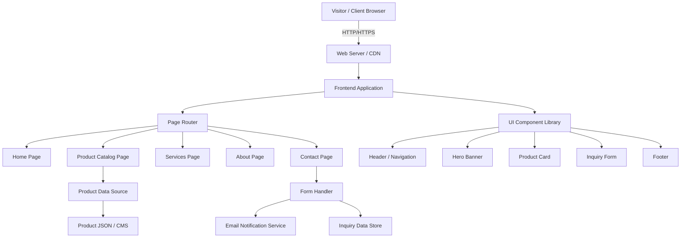
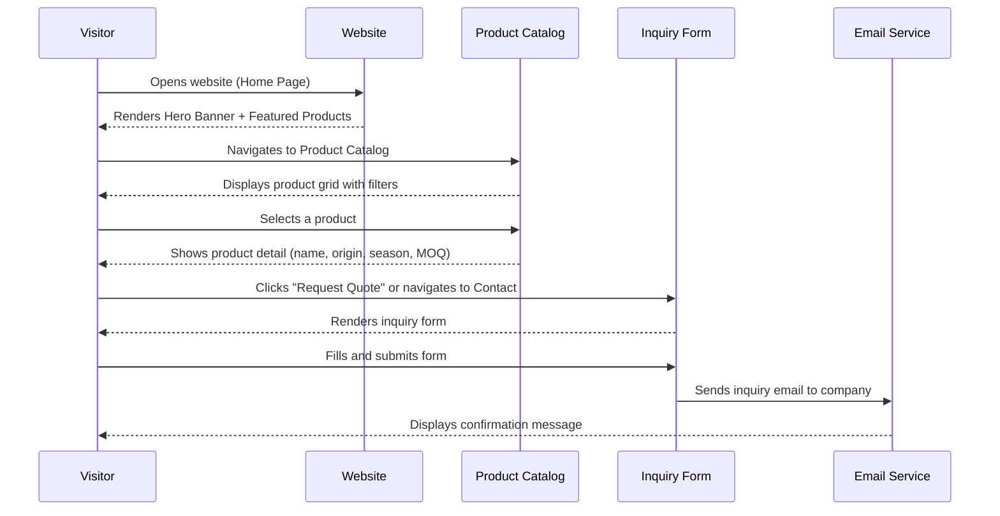
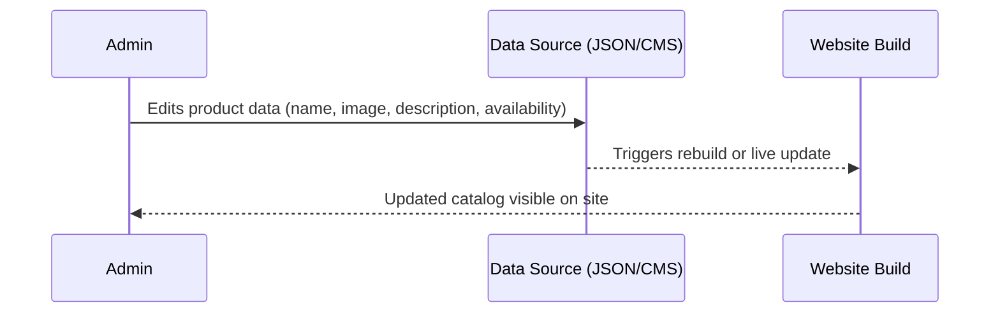

# Design Document: TAMILARASU ENTERPRISES Website

## Overview

TAMILARASU ENTERPRISES is a fresh products importing and exporting company that requires a professional, modern website to establish its digital presence and facilitate B2B/B2C trade inquiries. The website will serve as the primary digital touchpoint for international buyers, sellers, and partners — showcasing the company's product catalog, services, and enabling direct contact and inquiry submissions.

The platform is designed as a multi-page static/server-rendered website with a clean, trust-inspiring aesthetic appropriate for the agri-trade industry. It will feature company branding, a dynamic product catalog, service descriptions, an inquiry/contact system, and an about section — all optimized for desktop and mobile viewing.

The architecture prioritizes fast load times, SEO visibility, and ease of maintenance, making it suitable for a growing trading company that needs to project credibility to international clients.

---

## Architecture



---

## Sequence Diagrams

### Main Flow: Visitor Browses Products and Submits Inquiry



### Flow: Admin Updates Product Catalog



---

## Components and Interfaces

### Component 1: Header / Navigation

**Purpose**: Provides site-wide navigation and company branding.

**Interface**:
```pascal
STRUCTURE NavigationItem
  label: String
  href: String
  isActive: Boolean
END STRUCTURE

PROCEDURE renderHeader(navItems: List<NavigationItem>, logoUrl: String)
  INPUT: navItems, logoUrl
  OUTPUT: Rendered HTML header with logo and nav links
END PROCEDURE
```

**Responsibilities**:
- Display TAMILARASU ENTERPRISES logo and company name
- Provide navigation links: Home, Products, Services, About, Contact
- Highlight the active page
- Collapse into a hamburger menu on mobile

---

### Component 2: Hero Banner

**Purpose**: First visual impression — communicates brand identity and value proposition.

**Interface**:
```pascal
STRUCTURE HeroBanner
  headline: String
  subheadline: String
  ctaLabel: String
  ctaHref: String
  backgroundImageUrl: String
END STRUCTURE

PROCEDURE renderHero(banner: HeroBanner)
  INPUT: banner
  OUTPUT: Full-width banner section with headline, subtext, and CTA button
END PROCEDURE
```

**Responsibilities**:
- Display a compelling headline (e.g., "Fresh from Farm to World")
- Show a call-to-action button linking to Products or Contact
- Use a high-quality background image of fresh produce

---

### Component 3: Product Card

**Purpose**: Displays a single product in the catalog grid.

**Interface**:
```pascal
STRUCTURE Product
  id: String
  name: String
  category: Enum(FRUIT, VEGETABLE, GRAIN, SPICE, OTHER)
  origin: String
  season: String
  minimumOrderQuantity: String
  unit: String
  imageUrl: String
  description: String
  isAvailable: Boolean
  certifications: List<String>
END STRUCTURE

PROCEDURE renderProductCard(product: Product)
  INPUT: product
  OUTPUT: Card UI with image, name, origin, availability badge, and inquiry button
END PROCEDURE
```

**Responsibilities**:
- Show product image, name, origin country, and availability
- Display certifications (e.g., Organic, FSSAI, APEDA)
- Provide a "Request Quote" button that pre-fills the inquiry form

---

### Component 4: Product Catalog Page

**Purpose**: Lists all available products with filtering and search.

**Interface**:
```pascal
PROCEDURE renderCatalog(products: List<Product>, filters: FilterState)
  INPUT: products list, active filter state
  OUTPUT: Filtered, paginated product grid
END PROCEDURE

STRUCTURE FilterState
  selectedCategory: String
  searchQuery: String
  showAvailableOnly: Boolean
END STRUCTURE
```

**Responsibilities**:
- Render a responsive grid of ProductCards
- Support filtering by category (Fruits, Vegetables, Spices, etc.)
- Support text search by product name
- Show "No results" state when filters return empty

---

### Component 5: Services Section

**Purpose**: Describes the import/export services offered by the company.

**Interface**:
```pascal
STRUCTURE Service
  title: String
  description: String
  iconUrl: String
  highlights: List<String>
END STRUCTURE

PROCEDURE renderServices(services: List<Service>)
  INPUT: services list
  OUTPUT: Grid of service cards with icons and descriptions
END PROCEDURE
```

**Responsibilities**:
- Display services: Export, Import, Custom Packaging, Quality Assurance, Logistics Support
- Each service card shows an icon, title, description, and key highlights
- Link to Contact page for service inquiries

---

### Component 6: Inquiry / Contact Form

**Purpose**: Allows visitors to submit product inquiries or general contact requests.

**Interface**:
```pascal
STRUCTURE InquiryFormData
  fullName: String
  email: String
  phone: String
  country: String
  companyName: String
  inquiryType: Enum(PRODUCT_INQUIRY, EXPORT_REQUEST, IMPORT_REQUEST, GENERAL)
  productName: String
  quantity: String
  message: String
END STRUCTURE

PROCEDURE renderInquiryForm(prefillProduct: String OPTIONAL)
  INPUT: optional pre-filled product name
  OUTPUT: Rendered form with validation
END PROCEDURE

PROCEDURE submitInquiry(formData: InquiryFormData): SubmissionResult
  INPUT: validated form data
  OUTPUT: SubmissionResult (success or error)
END PROCEDURE
```

**Responsibilities**:
- Validate all required fields before submission
- Support pre-filling product name from catalog "Request Quote" button
- Show success confirmation after submission
- Send email notification to company

---

### Component 7: About Section

**Purpose**: Communicates company history, mission, values, and team.

**Interface**:
```pascal
STRUCTURE CompanyInfo
  foundedYear: Number
  mission: String
  vision: String
  values: List<String>
  teamMembers: List<TeamMember>
  certifications: List<String>
  exportDestinations: List<String>
END STRUCTURE

STRUCTURE TeamMember
  name: String
  role: String
  photoUrl: String
  bio: String
END STRUCTURE

PROCEDURE renderAbout(info: CompanyInfo)
  INPUT: company info
  OUTPUT: About page with story, mission/vision, team grid, and certifications
END PROCEDURE
```

**Responsibilities**:
- Tell the company story and founding background
- Display mission, vision, and core values
- Show export destinations on a world map or list
- Display certifications and compliance badges

---

### Component 8: Footer

**Purpose**: Site-wide footer with links, contact info, and social media.

**Interface**:
```pascal
STRUCTURE FooterData
  address: String
  phone: String
  email: String
  socialLinks: List<SocialLink>
  quickLinks: List<NavigationItem>
END STRUCTURE

PROCEDURE renderFooter(data: FooterData)
  INPUT: footer data
  OUTPUT: Rendered footer with contact info, links, and copyright
END PROCEDURE
```

**Responsibilities**:
- Display company address, phone, and email
- Quick navigation links
- Social media icons (LinkedIn, WhatsApp, Instagram)
- Copyright notice

---

## Data Models

### Model 1: Product

```pascal
STRUCTURE Product
  id: String                          // Unique identifier (e.g., "mango-alphonso")
  name: String                        // Display name (e.g., "Alphonso Mango")
  category: String                    // FRUIT | VEGETABLE | SPICE | GRAIN | OTHER
  subcategory: String                 // e.g., "Tropical Fruits"
  origin: String                      // Country/region of origin
  season: String                      // Availability season (e.g., "March - June")
  minimumOrderQuantity: String        // e.g., "500 kg"
  unit: String                        // kg | MT | boxes
  imageUrl: String                    // Path to product image
  galleryImages: List<String>         // Additional images
  description: String                 // Full product description
  isAvailable: Boolean                // Current availability
  certifications: List<String>        // e.g., ["Organic", "APEDA", "FSSAI"]
  exportDestinations: List<String>    // Countries this product is exported to
  packagingOptions: List<String>      // e.g., ["5kg box", "10kg carton"]
  shelfLife: String                   // e.g., "14 days at 8°C"
  tags: List<String>                  // Search tags
END STRUCTURE
```

**Validation Rules**:
- `id` must be unique and URL-safe (lowercase, hyphens only)
- `name` must be non-empty, max 100 characters
- `category` must be one of the defined enum values
- `imageUrl` must be a valid relative or absolute URL
- `minimumOrderQuantity` must be non-empty

---

### Model 2: InquiryFormData

```pascal
STRUCTURE InquiryFormData
  fullName: String          // Required, 2-100 chars
  email: String             // Required, valid email format
  phone: String             // Optional, international format
  country: String           // Required, country of origin
  companyName: String       // Optional
  inquiryType: String       // PRODUCT_INQUIRY | EXPORT_REQUEST | IMPORT_REQUEST | GENERAL
  productName: String       // Optional, pre-filled from catalog
  quantity: String          // Optional, requested quantity
  message: String           // Required, 10-2000 chars
  submittedAt: DateTime     // Auto-set on submission
END STRUCTURE
```

**Validation Rules**:
- `fullName`: required, 2–100 characters
- `email`: required, must match email regex pattern
- `country`: required
- `message`: required, minimum 10 characters
- `inquiryType`: must be one of the defined enum values

---

### Model 3: SiteConfiguration

```pascal
STRUCTURE SiteConfiguration
  companyName: String           // "TAMILARASU ENTERPRISES"
  tagline: String               // e.g., "Fresh from Farm to World"
  logoUrl: String
  contactEmail: String
  contactPhone: String
  whatsappNumber: String
  address: String
  socialLinks: List<SocialLink>
  featuredProductIds: List<String>
  heroImages: List<String>
END STRUCTURE

STRUCTURE SocialLink
  platform: String    // linkedin | instagram | whatsapp | facebook
  url: String
END STRUCTURE
```

---

## Algorithmic Pseudocode

### Algorithm 1: Product Catalog Filtering

```pascal
ALGORITHM filterProducts(products, filters)
  INPUT: products (List<Product>), filters (FilterState)
  OUTPUT: filteredProducts (List<Product>)

BEGIN
  filteredProducts ← EMPTY LIST

  FOR each product IN products DO
    ASSERT product IS valid Product structure

    categoryMatch ← (filters.selectedCategory = "ALL") OR
                    (product.category = filters.selectedCategory)

    searchMatch ← (filters.searchQuery = "") OR
                  (product.name CONTAINS filters.searchQuery CASE_INSENSITIVE) OR
                  (product.tags CONTAINS filters.searchQuery CASE_INSENSITIVE)

    availabilityMatch ← (filters.showAvailableOnly = false) OR
                        (product.isAvailable = true)

    IF categoryMatch AND searchMatch AND availabilityMatch THEN
      filteredProducts.ADD(product)
    END IF
  END FOR

  RETURN filteredProducts
END
```

**Preconditions**:
- `products` is a non-null list (may be empty)
- `filters.selectedCategory` is either "ALL" or a valid category string
- `filters.searchQuery` is a string (may be empty)

**Postconditions**:
- Every product in `filteredProducts` satisfies all active filter criteria
- No product is duplicated in the result
- If all filters are at default values, result equals the full input list

**Loop Invariants**:
- All products added to `filteredProducts` so far satisfy all filter conditions

---

### Algorithm 2: Inquiry Form Validation

```pascal
ALGORITHM validateInquiryForm(formData)
  INPUT: formData (InquiryFormData)
  OUTPUT: ValidationResult (isValid: Boolean, errors: Map<String, String>)

BEGIN
  errors ← EMPTY MAP

  // Validate fullName
  IF formData.fullName IS NULL OR formData.fullName.length < 2 THEN
    errors.SET("fullName", "Full name must be at least 2 characters")
  END IF

  // Validate email
  IF formData.email IS NULL OR NOT isValidEmail(formData.email) THEN
    errors.SET("email", "Please enter a valid email address")
  END IF

  // Validate country
  IF formData.country IS NULL OR formData.country = "" THEN
    errors.SET("country", "Please select your country")
  END IF

  // Validate inquiryType
  validTypes ← ["PRODUCT_INQUIRY", "EXPORT_REQUEST", "IMPORT_REQUEST", "GENERAL"]
  IF formData.inquiryType NOT IN validTypes THEN
    errors.SET("inquiryType", "Please select an inquiry type")
  END IF

  // Validate message
  IF formData.message IS NULL OR formData.message.length < 10 THEN
    errors.SET("message", "Message must be at least 10 characters")
  END IF

  isValid ← (errors.SIZE = 0)

  RETURN ValidationResult(isValid, errors)
END
```

**Preconditions**:
- `formData` is a non-null object
- All string fields are either null or string type

**Postconditions**:
- If `isValid = true`, all required fields pass their validation rules
- If `isValid = false`, `errors` contains at least one entry with a descriptive message
- No field is validated more than once

---

### Algorithm 3: Inquiry Form Submission

```pascal
ALGORITHM submitInquiry(formData)
  INPUT: formData (InquiryFormData)
  OUTPUT: SubmissionResult (success: Boolean, message: String)

BEGIN
  // Step 1: Validate
  validationResult ← validateInquiryForm(formData)

  IF NOT validationResult.isValid THEN
    RETURN SubmissionResult(false, "Validation failed", validationResult.errors)
  END IF

  // Step 2: Enrich data
  formData.submittedAt ← getCurrentDateTime()

  // Step 3: Send email notification
  emailPayload ← buildEmailPayload(formData)
  emailResult ← sendEmail(emailPayload, COMPANY_CONTACT_EMAIL)

  IF emailResult.failed THEN
    RETURN SubmissionResult(false, "Failed to send inquiry. Please try again.")
  END IF

  // Step 4: Store inquiry (optional persistence)
  storeInquiry(formData)

  RETURN SubmissionResult(true, "Your inquiry has been sent. We will contact you within 24 hours.")
END
```

**Preconditions**:
- `formData` is a non-null InquiryFormData object
- Email service is configured and reachable

**Postconditions**:
- If `success = true`, an email has been dispatched to the company
- If `success = false`, no email was sent and the error is described in `message`
- `formData.submittedAt` is set only on successful validation

---

### Algorithm 4: Email Payload Builder

```pascal
ALGORITHM buildEmailPayload(formData)
  INPUT: formData (InquiryFormData)
  OUTPUT: EmailPayload

BEGIN
  subject ← "New Inquiry: " + formData.inquiryType + " from " + formData.fullName

  body ← SEQUENCE
    "Name: " + formData.fullName + NEWLINE
    "Email: " + formData.email + NEWLINE
    "Phone: " + formData.phone + NEWLINE
    "Country: " + formData.country + NEWLINE
    "Company: " + formData.companyName + NEWLINE
    "Inquiry Type: " + formData.inquiryType + NEWLINE
    "Product: " + formData.productName + NEWLINE
    "Quantity: " + formData.quantity + NEWLINE
    "Message: " + formData.message + NEWLINE
    "Submitted At: " + formData.submittedAt
  END SEQUENCE

  RETURN EmailPayload(subject, body, formData.email)
END
```

---

## Key Functions with Formal Specifications

### Function 1: `filterProducts()`

```pascal
PROCEDURE filterProducts(products: List<Product>, filters: FilterState): List<Product>
```

**Preconditions**:
- `products` is a non-null list
- `filters` is a non-null FilterState with all fields initialized

**Postconditions**:
- Returns a subset of `products` where each item satisfies all filter criteria
- Result list preserves original order
- Empty list returned (not null) when no products match

**Loop Invariants**:
- All items appended to result satisfy the filter conditions at time of append

---

### Function 2: `validateInquiryForm()`

```pascal
PROCEDURE validateInquiryForm(formData: InquiryFormData): ValidationResult
```

**Preconditions**:
- `formData` is defined (not null)

**Postconditions**:
- `isValid = true` if and only if all required fields pass validation
- `errors` map is empty when `isValid = true`
- `errors` map contains field-specific messages when `isValid = false`
- No mutations to `formData`

---

### Function 3: `submitInquiry()`

```pascal
PROCEDURE submitInquiry(formData: InquiryFormData): SubmissionResult
```

**Preconditions**:
- `formData` is a non-null InquiryFormData
- Email service credentials are configured in environment

**Postconditions**:
- On success: email dispatched, `success = true`, confirmation message returned
- On failure: no email sent, `success = false`, error message returned
- `formData` is not mutated except for `submittedAt` timestamp

---

### Function 4: `isValidEmail()`

```pascal
PROCEDURE isValidEmail(email: String): Boolean
```

**Preconditions**:
- `email` is a string (may be empty)

**Postconditions**:
- Returns `true` if email matches standard RFC 5322 format
- Returns `false` for empty string, null, or malformed email
- No side effects

---

## Example Usage

```pascal
// Example 1: Filter products by category
filters ← FilterState(
  selectedCategory: "FRUIT",
  searchQuery: "",
  showAvailableOnly: true
)
availableFruits ← filterProducts(allProducts, filters)
DISPLAY availableFruits ON catalogGrid

// Example 2: Submit an inquiry from the catalog
formData ← InquiryFormData(
  fullName: "Ahmed Al-Rashid",
  email: "ahmed@tradeco.ae",
  phone: "+971501234567",
  country: "United Arab Emirates",
  companyName: "TradeCo LLC",
  inquiryType: "PRODUCT_INQUIRY",
  productName: "Alphonso Mango",
  quantity: "2 MT",
  message: "We are interested in importing Alphonso Mangoes for the UAE market."
)
result ← submitInquiry(formData)

IF result.success THEN
  DISPLAY "Thank you! We will contact you within 24 hours."
ELSE
  DISPLAY result.message
END IF

// Example 3: Search products
filters ← FilterState(
  selectedCategory: "ALL",
  searchQuery: "banana",
  showAvailableOnly: false
)
searchResults ← filterProducts(allProducts, filters)
```

---

## Correctness Properties

*A property is a characteristic or behavior that should hold true across all valid executions of a system — essentially, a formal statement about what the system should do. Properties serve as the bridge between human-readable specifications and machine-verifiable correctness guarantees.*

### Property 1: Catalog Completeness

*For any* product list and any FilterState, if a product satisfies all active filter criteria (category, search query, and availability), then that product SHALL appear in the result returned by `filterProducts`.

**Validates: Requirements 3.1, 3.5**

---

### Property 2: Catalog Soundness

*For any* product list and any FilterState, every product returned by `filterProducts` SHALL satisfy all active filter criteria — no product that fails any criterion may appear in the result.

**Validates: Requirements 3.2, 3.3, 3.4**

---

### Property 3: Filter Idempotency

*For any* product list and any FilterState, applying `filterProducts` twice with the same FilterState produces an identical result to applying it once — the filter operation is pure and has no side effects.

**Validates: Requirements 3.2, 3.3, 3.4, 3.5**

---

### Property 4: Form Validation Completeness

*For any* InquiryFormData where at least one required field (fullName, email, country, inquiryType, or message) is empty or fails its validation rule, `validateInquiryForm` SHALL return a ValidationResult with `isValid = false` and at least one field-specific error entry.

**Validates: Requirements 8.1, 8.2, 8.3, 8.4, 8.5, 8.6, 8.7, 8.8**

---

### Property 5: Form Validation Soundness

*For any* InquiryFormData where all required fields are present and pass their respective validation rules, `validateInquiryForm` SHALL return a ValidationResult with `isValid = true` and an empty errors map.

**Validates: Requirements 8.7**

---

### Property 6: Submission Atomicity

*For any* valid InquiryFormData, `submitInquiry` SHALL either (a) dispatch the email AND return `success = true`, or (b) send no email AND return `success = false` — no partial state where an email is sent but failure is reported, or vice versa.

**Validates: Requirements 7.2, 7.4**

---

### Property 7: No Duplicate Submissions

*For any* inquiry submission in progress, the submit button SHALL be disabled until the submission completes, ensuring that a single form fill cannot produce more than one dispatched email.

**Validates: Requirements 7.5**

---

### Property 8: Email Validity

*For any* string `email`, `isValidEmail(email) = true` if and only if the string contains exactly one `@` symbol with a non-empty local part and a non-empty domain part — and `false` for any empty, null, or structurally malformed string.

**Validates: Requirements 8.3**

---

### Property 9: Active Navigation Highlighting

*For any* page route in the Website, the Navigation SHALL mark exactly one link as active — the link corresponding to the current page — and all other links SHALL be marked inactive.

**Validates: Requirements 1.3**

---

### Property 10: Request Quote Pre-fill

*For any* product in the Product_Catalog, clicking the "Request Quote" button on that product's Product_Card SHALL result in the Inquiry_Form being pre-filled with that product's name in the product name field.

**Validates: Requirements 3.7**

---

### Property 11: Product Data Completeness

*For any* product record in the data source, all required fields (`id`, `name`, `category`, `origin`, `minimumOrderQuantity`, `imageUrl`, `description`, `isAvailable`) SHALL be present and non-empty, and `category` SHALL be one of the defined enum values.

**Validates: Requirements 12.1, 12.3**

---

### Property 12: Input Sanitization

*For any* InquiryFormData containing special characters or potential injection sequences, the email body produced by `buildEmailPayload` SHALL not contain unescaped injection sequences — all inputs SHALL be sanitized before inclusion.

**Validates: Requirements 9.2**

---

## Error Handling

### Error Scenario 1: Form Submission Network Failure

**Condition**: Email service is unreachable or returns an error during inquiry submission.
**Response**: Display a user-friendly error message: "We couldn't send your inquiry. Please try again or contact us directly at [email]."
**Recovery**: Provide direct email/WhatsApp contact as fallback. Optionally retry once automatically.

---

### Error Scenario 2: Product Image Load Failure

**Condition**: A product image URL is broken or the image fails to load.
**Response**: Display a placeholder image with the product category icon.
**Recovery**: Log the broken URL for admin review. No user-facing error shown.

---

### Error Scenario 3: Empty Product Catalog

**Condition**: The product data source returns an empty list (maintenance or data error).
**Response**: Display a friendly "Our catalog is being updated. Please check back soon or contact us directly." message.
**Recovery**: Show contact information prominently so visitors can still reach the company.

---

### Error Scenario 4: Invalid Form Input

**Condition**: User submits the inquiry form with missing or malformed fields.
**Response**: Highlight invalid fields with red borders and inline error messages. Do not submit the form.
**Recovery**: User corrects the fields and resubmits. No data is lost between attempts.

---

## Testing Strategy

### Unit Testing Approach

Test each pure function in isolation:
- `filterProducts()`: Test with empty list, all-match filters, no-match filters, partial matches, case-insensitive search
- `validateInquiryForm()`: Test each required field independently, test boundary values (min/max lengths), test invalid email formats
- `isValidEmail()`: Test valid emails, missing `@`, multiple `@`, empty string, null
- `buildEmailPayload()`: Test that all fields appear in the output body

### Property-Based Testing Approach

**Property Test Library**: fast-check (JavaScript) or Hypothesis (Python)

Key properties to test:
- **Filter soundness**: For any random product list and filter state, every item in the result satisfies all filters
- **Filter completeness**: For any random product list with default filters, result equals input
- **Validation consistency**: For any form data where all required fields are valid, `validateInquiryForm` returns `isValid = true`
- **Email idempotency**: `isValidEmail(email)` returns the same result for the same input regardless of call order

### Integration Testing Approach

- Test the full inquiry submission flow: form fill → validation → email dispatch → confirmation display
- Test catalog page: data load → render → filter interaction → product detail navigation
- Test mobile responsiveness: navigation collapse, form usability, card layout on small screens

---

## Performance Considerations

- **Static Generation**: Product catalog and content pages should be statically generated at build time for fast initial load (target < 2s LCP).
- **Image Optimization**: All product images should be served in WebP format with responsive sizes. Lazy-load images below the fold.
- **Minimal JavaScript**: Use progressive enhancement — the site should be readable without JavaScript. Forms degrade gracefully.
- **CDN Delivery**: Static assets (images, CSS, JS) served via CDN for global performance.
- **Catalog Pagination**: If the product catalog exceeds 20 items, implement client-side pagination or infinite scroll to avoid rendering all cards at once.

---

## Security Considerations

- **Form Spam Prevention**: Implement honeypot fields and/or reCAPTCHA on the inquiry form to prevent automated spam submissions.
- **Input Sanitization**: All form inputs must be sanitized before inclusion in email bodies to prevent injection attacks.
- **Email Exposure**: The company's contact email should not be exposed in client-side source code; route through a server-side handler or form service (e.g., Formspree, EmailJS with restricted keys).
- **HTTPS Enforcement**: The site must be served exclusively over HTTPS. Redirect all HTTP traffic.
- **Content Security Policy**: Implement CSP headers to prevent XSS attacks.
- **No Sensitive Data Storage**: Inquiry form data should not be stored in client-side storage (localStorage/sessionStorage).

---

## Dependencies

| Dependency | Purpose | Notes |
|---|---|---|
| HTML5 / CSS3 | Page structure and styling | Core web standards |
| JavaScript (ES6+) | Interactivity, form handling, filtering | Vanilla JS or lightweight framework |
| Mermaid.js | Architecture diagrams (design doc only) | Not used in production site |
| EmailJS / Formspree | Server-side email delivery for contact form | No backend required |
| Google Fonts | Typography (e.g., Inter, Poppins) | For professional appearance |
| Font Awesome / Heroicons | Icons for services and UI | Lightweight icon set |
| Swiper.js | Hero image carousel / product gallery | Optional, lightweight |
| reCAPTCHA v3 | Spam prevention on inquiry form | Google service |
| Netlify / Vercel / GitHub Pages | Static site hosting | Free tier suitable for initial launch |
